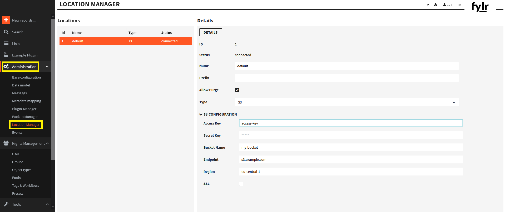

# fylr installation methods

* [container desktop](desktop/README.md): Set up the fylr container on your desktop

* [container server](docker/README.md): Set up fylr container on a server

* [kubernetes](https://github.com/programmfabrik/fylr-helm): We provide a helm chart (starting in November 2022) [there](https://github.com/programmfabrik/fylr-helm).

* [fylr.exe](windows/README.md): Set up fylr.exe on a Windows desktop

After installation you should have this running fylr webfrontend:


## Changelog

## 10.2022

There has been a rename from clientSecret to secret in `fylr.yml` ...

```
fylr:
  services:
    api:
      oauth2Server:
        clients:
          EXAMPLECLIENT:
            secret:
```

## 9.2022

There has been a change in the `fylr.yml` ...

new:

```
           redirectURIs:
             - http://example
```

old:

```
           redirectURL: http://example
```

## 22.8.2022

fylr received a revision that removes backward compatibility. This is an important change and requires you to update your configuration concerning the execserver. Here are the updated example configurations:

* [desktop/execserver.yml](desktop/execserver.yml)
* [docker/config/execserver/fylr.yml](docker/config/execserver/fylr.yml)

```
fylr:
  services:
    execserver:
      services:
        pdf2pages:
          commands:
            fylr_pdf2pages:
              prog: "fylr_pdf2pages"
              # fylr_* utils use other programs to do their job. These
              # programs must be either found in the $PATH of the OS or
              # passed in by environment in the form of FYLR_CMD_<prog>
              # The <prog> is the program name (upper case)
              #
              # In case fylr_metadata is not in the PATH:
              env:
                - FYLR_CMD_FYLR_METADATA=../../utils/fylr_metadata/fylr_metadata
```

## 9.5.2022

On 09/05/2022, fylr received a revision that removes backward compatibility. This is an important change and requires you to update your configuration.

Migration guide:

This revision changes the way fylr works with files. The old way was to store files in a static location (s3). The new way is to support multiple locations. This allows you to store files in multiple locations, for example on a local hard drive or in cloud storage (currently we only support s3). With this change, we have also removed the feature to create s3 buckets. This task is now the responsibility of the user. In addition, we now finally support configuring the S3 bucket in fylr. In version v6.1.0-beta.5, we added the functionality to configure the location either through the configuration (on first startup as init config) or through the web frontend.

Old configuration:

```yaml
fylr:
  ...
  # DEPRECATED, will be removed in next version
  # files are stored in S3. Buckets are created by FYLR automatically
  s3:
    endpoint: ""
    accessKeyID: ""
    secretAccessKey: ""
    bucketLocation: ""
    ssl: false
    allowPurge: false
```

New configuration:

```yaml
fylr:
  # encryptionKey is used to AES-encrypt sensitive information before writing it
  # to the database. It must be 32 bytes long. Default is empty.
  #    openssl rand -hex 16
  encryptionKey: "41559d909bf92473c250c0195fc8346a"
  ...
  db:
    driver: postgres
    ...
    init:
      config:
        system:
          config:
            purge:
              allow_purge: true
              purge_storage: true
            location_defaults:
              originals: S3
              versions: S3
              backups: S3
      locations:
        S3:
          kind: s3
          prefix: ""
          allow_purge: true
          config:
            s3:
              # ENV: FYLR_DB_INIT_LOCATIONS_S3_CONFIG_S3_BUCKET
              bucket: fylr-assets
              # ENV: FYLR_DB_INIT_LOCATIONS_S3_CONFIG_S3_ENDPOINT
              endpoint: ""
              # ENV: FYLR_DB_INIT_LOCATIONS_S3_CONFIG_S3_ACCESSKEY
              accesskey: ""
              # ENV: FYLR_DB_INIT_LOCATIONS_S3_CONFIG_S3_SECRETKEY
              secretkey: ""
              # ENV: FYLR_DB_INIT_LOCATIONS_S3_CONFIG_S3_REGION
              region: ""
              # ENV: FYLR_DB_INIT_LOCATIONS_S3_CONFIG_S3_SSL
              ssl: false
```

**ATTENTION**: When you configure S3 credentials in the configuration, these credentials are stored encrypted in the database. To change the credentials for the S3 bucket, you must change the configuration through the web front end. This is because the credentials are written to the database once at first startup and cannot be changed after that.

For existing installations, you may need to change the configuration. Even if the configuration has been migrated, you should review and resave the configuration to store the credentials encrypted in the database.



