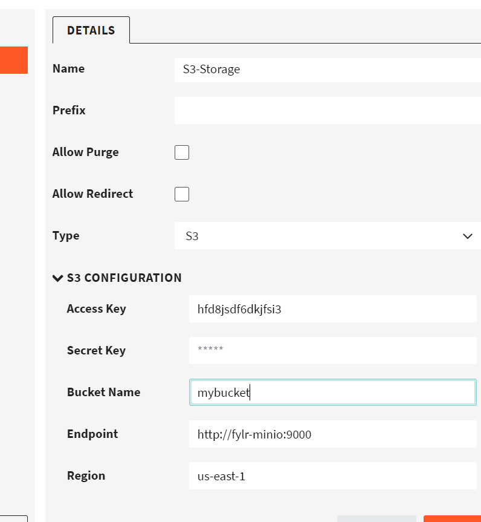

# Requirements

* Since fylr requires a fully running installation of docker, refer to it's official documentation [how to install docker](https://docs.docker.com/engine/install/) and follow these steps.
* 16 GB of RAM
* Memory setting for elastic search:

```bash
echo "vm.max_map_count=262144" >> /etc/sysctl.d/99-memory_for_elasticearch.conf
sysctl -p /etc/sysctl.d/99-memory_for_elasticearch.conf
```

The following commands assume a Debian or Ubuntu server as an example and a bash shell.

## Installation

Our recommendation is to create the following directory tree to run fylr:

```text
./fylr
  /config
    /execserver
    /fylr
  /docker-compose.yml
```

The following commands help you to set up this directory tree:

```bash
mkdir -p fylr/config/fylr fylr/config/execserver fylr/resources
```

**ATTENTION:**

As you have seen, we do not create directories for persistence of **elasticsearch**, **minio** and **postgres** data. If you want to keep the data on your host as a volume mapping, you will need to create the directories yourself.

## configuration

We suggest that you use our example configuration as a starting point:

```bash
cd fylr
curl https://raw.githubusercontent.com/programmfabrik/fylr-install/main/docker/config/fylr/fylr.yml -o config/fylr/fylr.yml
curl https://raw.githubusercontent.com/programmfabrik/fylr-install/main/docker/config/execserver/fylr.yml -o config/execserver/fylr.yml
```

## docker-compose

Much of the setup is encapsulated in a docker-compose file. Download and use it like this:

The following commands also assume that you are in the fylr directory. (`cd fylr`)

```bash
apt-get install docker-compose
curl https://raw.githubusercontent.com/programmfabrik/fylr-install/main/docker/docker-compose.postgres.yml -o docker-compose.yml
docker-compose up
```

## Result

You can now surf to your fylr webfrontend at Port 8080

Default login is root with password admin. Please replace with something secure.

## Storage

The included s3 storage will not have a bucket yet, so do not forget to...
* surf to port 9001
* create a bucket and access policy
* add them into the fylr web frontend: gears symbol -> Location manager:



## Troubleshooting

* `docker-compose` needs to be executed in the directory with the `docker-compose.yml`.

* When elasticsearch does not work, make sure you used `sysctl` as shown above.

## Further reading

* [Import an easydb into fylr](../customization/restore-easydb5.md)

* [Use a customized Web-Frontend](../customization/webfrontend.md)
